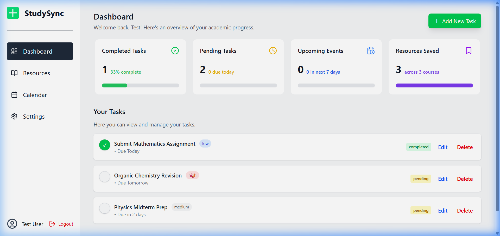
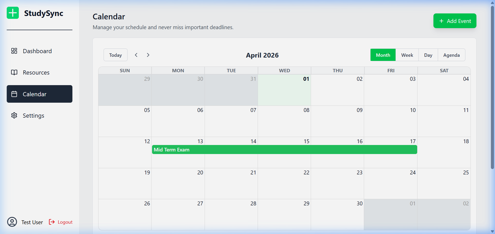
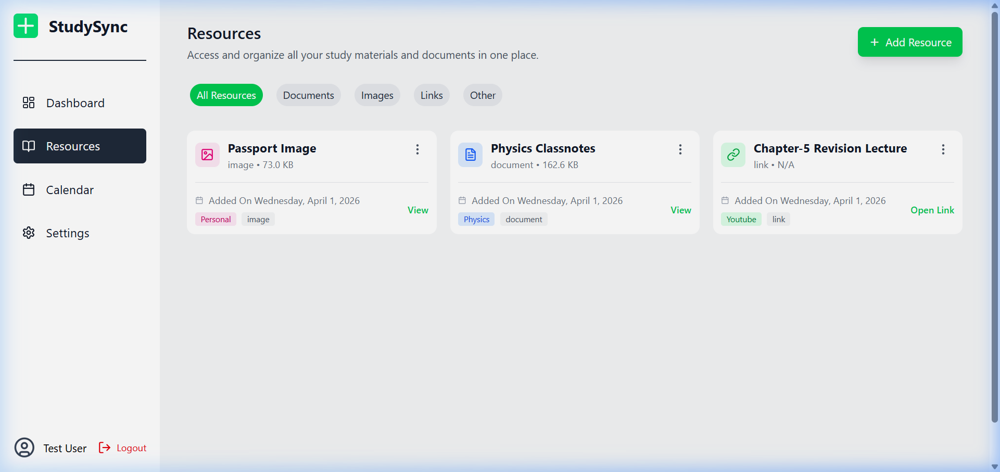

# 📚 StudySync

**StudySync** is a full-stack student productivity platform designed to help students manage their study resources, keep track of their schedule, and organize their daily tasks efficiently.

---

## 🖼️ Application Preview

### 🏠 Landing Page
Visual overview of what StudySync offers.


### 📊 Dashboard
Your personal command center to track progress and pending tasks.


### 📅 Calendar
Stay organized with a clean, intuitive monthly view for your study sessions.


### 📂 Resources
Manage all your study materials and documents in one central hub.


---

## 🌟 Features

- **Dashboard**: A quick overview of your current progress and upcoming tasks.
- **Dynamic Calendar**: Plan your study sessions and stay on top of deadlines with a built-in calendar view.
- **Resource Management**: Upload and organize study materials, notes, and resources in one place.
- **Task Tracking**: Create and manage "to-do" lists to structure your daily workload.
- **Profile Settings**: Personalize your account and secure your login with JWT authentication.

## 🛠️ Project Structure

The project is divided into two main parts:

1.  **/Frontend**: A modern React application built with Vite and Tailwind CSS.
2.  **/backend**: A robust Node.js and Express API, integrated with MongoDB and Supabase.

## 💻 Tech Stack

### Frontend
- **Framework**: React 19 (Vite)
- **Styling**: Tailwind CSS 4
- **Routing**: React Router 7
- **UI Components**: Lucide-React for icons, React Big Calendar for scheduling.
- **Notifications**: React Hot Toast

### Backend
- **Core**: Node.js, Express.js
- **Database**: MongoDB (via Mongoose)
- **Authentication**: JWT & Bcrypt
- **File Storage**: Supabase (Used for handling resource uploads)
- **Utilities**: Multer for file handling, Nodemailer for email notifications.

---

## 🚀 Getting Started

### 1. Backend Setup
Go to the `backend` folder and install dependencies:
```bash
cd backend
npm install
```

Create a `.env` file in the `backend` directory based on the configuration:
```env
PORT=8000
MONGODB_URI=your_mongodb_uri
CORS_ORIGIN=http://localhost:5173
ACCESS_TOKEN_SECRET=your_token_secret
REFRESH_TOKEN_SECRET=your_refresh_secret
SUPABASE_URL=your_supabase_url
SUPABASE_SECRET_KEY=your_supabase_key
SMTP_HOST=your_smtp_host
SMTP_PORT=your_smtp_port
SMTP_USER=your_smtp_user
SMTP_PASS=your_smtp_password
```

Start the backend server:
```bash
npm run dev
```

### 2. Frontend Setup
Go to the `Frontend` folder and install dependencies:
```bash
cd Frontend
npm install
```

Create a `.env` file in the `Frontend` directory:
```env
VITE_BACKEND_URL=http://localhost:8000
```

Start the development server:
```bash
npm run dev
```

The app will be available at `http://localhost:5173`.

---


## 🔒 Security
The project uses JWT for secure authentication, storing tokens safely to keep user sessions persistent and protected.